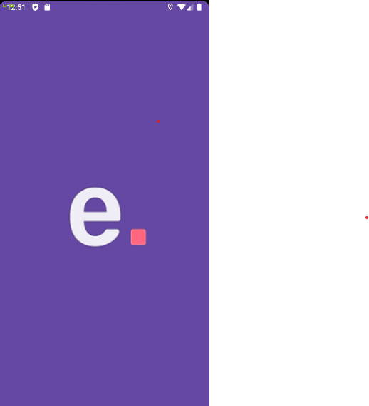
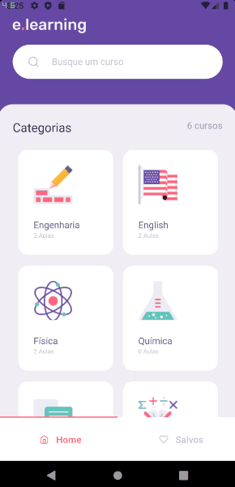

# E-Learning 📚
<p align="center"></p>
<p align="center">Search for a large variety of courses, watch the classes, and mark your favorite one.</p>

<hr>






## Technologies 💻:
- React Native
- Youtube API
- Async Storage
- Styled Components
- React Navigation - TabBar

## How to run 🚀:
```bash
# Make sure you have the API server running on your computer
# Clone this repository
$ git clone https://github.com/EduardoBravoP/elearning-mobile.git

# Go into the repository
$ cd elearning-mobile

# Install dependencies
$ yarn

# Run the app (iOS)
$ yarn ios

# Run the app (Android)
$ yarn android
```